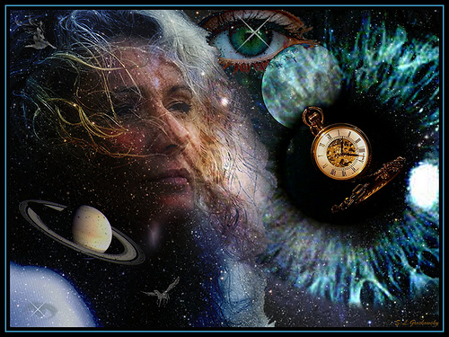

# The Day After Yesterday

## Introduction

Quantum mechanics and multi-dimensional space/time tend to be concepts acquired using "chunking", as understood from a meta-cognition perspective.  Acquiring high-level conceptual knowledge is known as "dah-knowledge". It is not a straight forward process:

```
$ give to me dah-knowledge
```


&#x20;Dah-knowledge takes time to acquire if the goal is meaningful (useful) academic mastery.  Monkeys can acquire dah-knowledge at the same level as Donald Trump, and we know how useful that is!


Once the light-bulb, lights up, and the gears start to turn, you will be on the path to dah-knowledge.  But first we must create the all knowing "hello" step.  The hello step is key to unlock powerful neurological connections that start from the Pineal Gland.


```bash
# Ain't no code for that yet, sorry
echo 'Trust me dude, I have acquired dah-knowledge'
```



